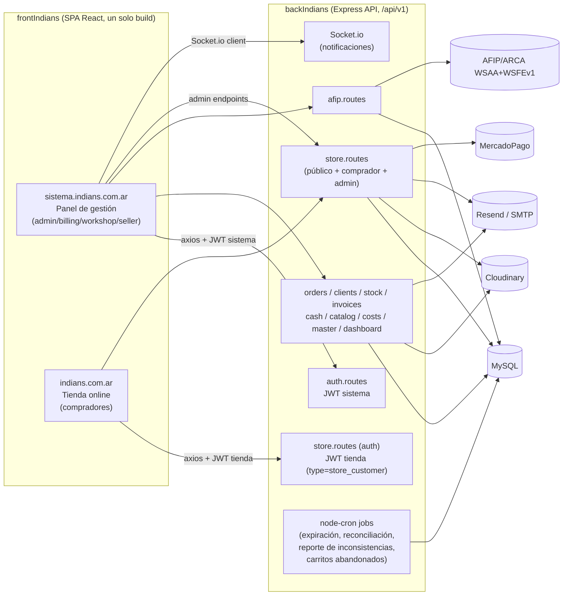

# 04 — Arquitectura

## Stack tecnológico

### Backend (`backIndians/`)
- **Runtime**: Node.js ≥20 (`.nvmrc: 20`), TypeScript 5.6 (`strict: true`).
- **Framework**: Express 4.19.
- **ORM/DB**: Sequelize 6.37 + `mysql2` 3.11 → **MySQL**.
- **Auth**: `jsonwebtoken` 9, `bcryptjs` 2.4.
- **Logging**: Pino 10 + `pino-http` + `pino-pretty` (dev).
- **AFIP/ARCA**: `node-forge` 1.4 (firma CMS/PKCS#7) + `soap` 1.10 (cliente WSAA/WSFEv1).
- **Pagos**: `mercadopago` SDK 3.1 (Preference/Payment, Checkout Pro).
- **Email**: `resend` 6.14 (tienda) + SMTP nativo (panel admin, `mailer.ts`).
- **Storage de imágenes**: `cloudinary` 2.5.
- **Tiempo real**: `socket.io` 4.8.
- **Jobs programados**: `node-cron` 4.6, todos en proceso (sin cola externa).
- **OAuth**: `google-auth-library` 10.
- **Seguridad HTTP**: `helmet`, `cors`, `express-rate-limit`, `express-validator`.
- **PDF**: `pdfkit` 0.15.
- **Tests**: Jest 30 + `ts-jest` + Supertest 7 (contra MySQL real, `maxWorkers:1`).

### Frontend (`frontIndians/`)
- **Framework**: React 19.2 + TypeScript ~6.0 + Vite 8.
- **Ruteo**: `react-router-dom` 6.30 (`createBrowserRouter`), code-splitting con `React.lazy`.
- **Estado servidor**: `@tanstack/react-query` 5.
- **Estado cliente**: `zustand` 5 (con middleware `persist`).
- **HTTP**: `axios` 1.16 (dos instancias independientes, ver más abajo).
- **Formularios**: `zod` 4 + `react-hook-form` 7 + `@hookform/resolvers`.
- **UI**: Tailwind CSS 3.4 (dos paletas: editorial tienda vs. admin indigo), `recharts` 3 (gráficos), `lucide-react` (íconos), `sonner` (toasts), `qrcode.react`, `react-dropzone`.
- **Tests**: Vitest 4 (`environment: 'node'`, sin jsdom — solo utils puros).
- **SEO**: metadata nativa de React 19 (hoisting de `<title>/<meta>`, sin `react-helmet`), JSON-LD manual, prerender puntual con Playwright (`scripts/prerender.mjs`) + sitemap generado en build.
- **Deploy**: FTP directo a hosting compartido (`basic-ftp`, script `scripts/deploy-ftp.mjs`).

### Base de datos
MySQL, gestionado con `sequelize-cli` (migraciones) + `sequelize.sync()` en desarrollo (ver [05-DATABASE.md](05-DATABASE.md) para el mecanismo de convivencia entre ambos).

## Arquitectura general

Monolito de dos capas separadas (SPA + API REST), sin microservicios, sin cola de mensajes externa, sin CI/CD. Dos frontends lógicos servidos por el **mismo build** de `frontIndians`, diferenciados en runtime por hostname:



## Estructura del frontend (`frontIndians/src/`)

```
api/         13 módulos, uno por dominio de backend, sobre axios
components/  afip/ costs/ layout/ orders/ seo/ store/ ui/ (design system)
context/     ConfirmContext (modal de confirmación async)
hooks/       useAuth, useAuthInit, useCosts, useIdleTimeout, useMasterData,
             useOrders, useSocket, useStoreInactivityTimer, useStoreTracker
pages/       admin/ auth/ billing/ cash/ catalog/ costs/ ecommerce/ stock/ store/ workshop/
router/      index.tsx — router único, separación por host + ProtectedRoute por rol
store/       7 stores zustand (auth, carritos, wishlist, notificaciones)
types/       index.ts (~900 líneas, tipos de dominio compartidos)
utils/       constants, formatters, host, logger, price, seo, validations
```

## Estructura del backend (`backIndians/src/`)

```
app.ts           Express: helmet, CORS, morgan, requestContext, rate-limit, rutas, errorHandler
server.ts        Entry point: validateEnv → connectDB → ensureSchema → seeds de arranque → HTTP+Socket.io → jobs
config/          db.ts, cloudinary.ts, socket.ts, dedupeIndexes.ts, ensureSchema.ts,
                 orderChecklists.ts, storeOrderFlow.ts
controllers/     handlers HTTP (parsean req, delegan a services, responden)
routes/          Express routers + express-validator + middlewares de auth/rol
models/          un archivo por modelo Sequelize + index.ts con todas las asociaciones
middlewares/     auth, authorize, storeAuth, errorHandler, rateLimit, turnstile,
                 upload (multer), requestContext, validación
services/        lógica de negocio por dominio (la mayoría de las reglas viven acá)
jobs/            node-cron: expiración de pedidos, reconciliación de pagos MP,
                 reporte diario de inconsistencias, carritos abandonados, scheduler
events/          storeEvents.ts (helper de analítica)
utils/           logger (Pino), sanitize, pdf.ts / store.pdf.ts, email.service.ts (Resend),
                 mailer.ts (SMTP), emailQueue.ts, cache en memoria
types/           UserRole, OrderStatus, JwtPayload, AuthRequest, tipos de logging
```

## Comunicación entre capas

- **Protocolo**: REST JSON sobre HTTPS, todo bajo el prefijo `/api/v1`.
- **Formato de respuesta estándar**: `{ success, data, meta? }` (paginado usa `meta`), desempaquetado en el interceptor de axios del frontend.
- **Dos clientes axios independientes** en el frontend (`src/api/axios.ts`):
  - `api` (sistema): inyecta `Authorization: Bearer` desde `authStore`; en 401 hace refresh silencioso con cola de reintentos; si falla, logout + redirect duro a `/login`.
  - `storeApi` (tienda): mismo patrón de refresh silencioso pero contra `useStoreAuthStore`; en fallo, rechaza con error para que la página muestre un toast (sin redirect duro).
- **Tiempo real**: Socket.io autenticado con JWT del sistema; el frontend invalida queries de React Query y agrega notificaciones in-app al recibir eventos (`order_created`, `status_changed`, `invoice_created`, `store_order_created`, `store_payment`).
- **SSE**: `/store/events` (Server-Sent Events) para invalidar cache de productos en la tienda cuando el admin los edita en vivo.
- **Uploads**: `multipart/form-data` vía `multer` (memoria) → stream a Cloudinary; endpoint genérico `POST /upload` + endpoints específicos por dominio que aceptan multipart directo.

## Autenticación (detalle técnico)

Dos sistemas de JWT completamente independientes y no intercambiables — ver [BR-AUTH-001 a BR-AUTH-004](03-BUSINESS-RULES.md#autenticación--sesión).

| | Sistema (staff) | Tienda (compradores) |
|---|---|---|
| Modelo | `User` | `StoreCustomer` |
| Secreto | `JWT_SECRET` / `JWT_REFRESH_SECRET` | `STORE_JWT_SECRET` / `STORE_JWT_REFRESH_SECRET` (fallback a los del sistema si no están seteadas) |
| Payload | `{ id, email, role, session_version }` | `{ sub, email, type:'store_customer', session_version }` |
| Access TTL | 15 min (`JWT_EXPIRES_IN`) | 15 min |
| Refresh TTL | 7 días | 30 días |
| Middleware | `middlewares/auth.ts` (`authenticate`) | `middlewares/storeAuth.ts` (`requireStoreAuth`/`optionalStoreAuth`) |
| Revocación | incrementar `session_version` | incrementar `session_version` |

## Autorización

- `middlewares/authorize.ts` — factory `authorize(...roles)` aplicado por ruta (no por controller), roles: `admin`, `billing`, `workshop`, `seller`.
- Sin sistema de permisos granular más allá de rol — no hay ACL por recurso individual.
- La tienda no tiene roles: solo autenticado/no autenticado (`StoreCustomer`); el panel de administración de la tienda usa los mismos roles del sistema (`admin`/`billing`).

## Manejo de errores

- **`AppError`** (`middlewares/errorHandler.ts`) — error de negocio con `statusCode`, `code`, `type`, `originalError` opcional.
- **`errorHandler`** — middleware final: `UniqueConstraintError` de Sequelize → 409 (con mensaje amigable para el caso de nombre de prenda duplicado), `ValidationError` → 422, `AppError` → su propio `statusCode`, cualquier otro → 500 (detalle solo en `development`).
- Todo error 4xx/5xx pasa por el logger con nivel `warn`/`error` según corresponda.
- El frontend replica errores relevantes hacia `POST /logs/client` para que queden en el mismo pipeline de logs.

## Archivos principales para orientarse rápido

| Si necesitás... | Mirá primero |
|---|---|
| Entender el checkout completo de la tienda | `backIndians/src/services/store.service.ts` (84KB) y `controllers/store.controller.ts` |
| Entender el flujo de estados de pedidos de fábrica | `backIndians/src/config/orderChecklists.ts`, `services/order.service.ts` |
| Entender el flujo de estados de tienda | `backIndians/src/config/storeOrderFlow.ts` **y su duplicado** `frontIndians/src/api/store.ts` |
| Agregar un endpoint nuevo | copiar el patrón de un router existente en `backIndians/src/routes/` + su controller/service |
| Agregar una página nueva | `frontIndians/src/router/index.tsx` (registrar ruta + rol) + carpeta correspondiente en `src/pages/` |
| Tocar el motor de costos | `backIndians/src/services/cost.service.ts` |
| Tocar AFIP | `backIndians/src/services/afip.service.ts` |

## Patrones utilizados

- **Service layer**: la lógica de negocio vive en `services/`, los `controllers/` son delgados (parsean/responden).
- **Snapshot inmutable**: costos (`OrderCostDetail`, `GarmentCostVersion`) y devoluciones no recalculan retroactivamente — se congelan al momento del evento.
- **Ledger de auditoría**: `CatalogStockMovement`, `StoreOrderStatusHistory`, `OrderStatusHistory`, `webhook_events` — nunca se sobreescribe, siempre se agrega una fila nueva.
- **Idempotencia explícita por columna de marca de tiempo**: `stock_reserved_at`, `stock_confirmed_at`, `stock_restored_at`, `cash_recorded_at` en `StoreOrder` — cada efecto colateral de un evento de negocio tiene su propia marca, para que un reintento no lo repita.
- **Gate de feature flag antes del efecto externo**: `assertAfipEnabled()` corta antes de tocar servicios externos, no depende de que la UI se comporte bien.
- **Getters DECIMAL→number en modelos Sequelize**: patrón consistente en todo el proyecto para no manejar strings de MySQL DECIMAL en el código de negocio.
- **Doble entorno de esquema (migraciones + `ensureSchema` + `dedupeIndexes`)**: ver detalle completo en [05-DATABASE.md](05-DATABASE.md), es una particularidad importante de este proyecto.

## Actualizar este documento cuando…

Cambie el stack (versión mayor de una dependencia core, nuevo framework), se agregue una integración externa nueva, o cambie el mecanismo de auth/autorización.
